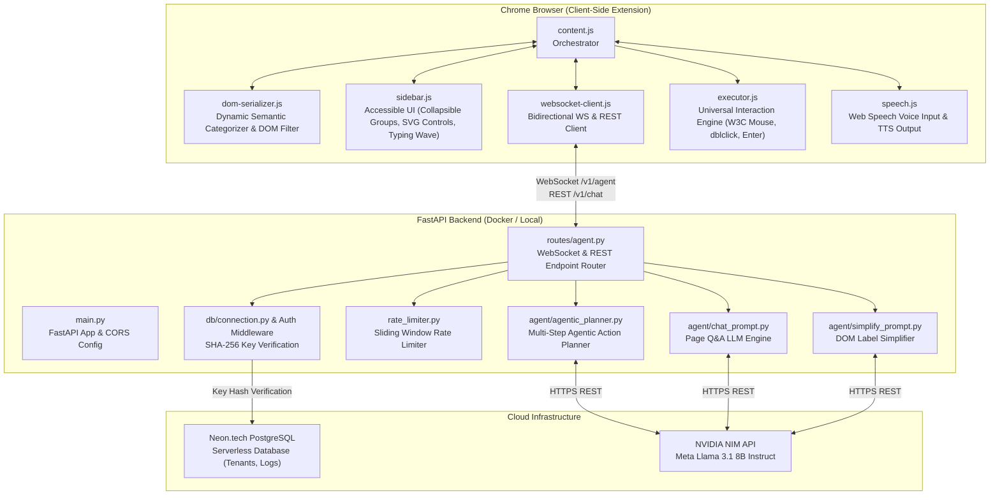

# Project Atlas — System Architecture & Technical Plan

> **Version:** 2.0 (Post-Agentic & Universal Engine Update)  
> **Status:** Active & Implemented  
> **Core Principle:** 100% Universal across all websites (Zero domain-specific logic).

---

## 1. High-Level System Architecture

Atlas connects browser users with AI-driven web accessibility through a 3-tier architecture:



---

## 2. Component Breakdown

### 2.1 Chrome Extension Layer (`client-script/`)

1. **`dom-serializer.js` (Page Scanner & Dynamic Semantic Categorizer)**:
   - Scans the active webpage DOM and discards invisible, non-interactive, machine-generated, or decorative noise.
   - Computes robust human-readable labels using a prioritized resolution chain (`aria-labelledby` → `aria-label` → `<label>` → inner text → `title` → `placeholder` → `name`).
   - Automatically groups interactive elements into dynamic semantic categories (e.g. 🗂️ Navigation, 📁 Files & Folders, 🔘 Actions & Controls, 🔍 Search & Inputs, 🔗 Links & Resources) using semantic roles and standard attributes without hardcoded site selectors.
   - Dispatches unique, stable synthetic IDs (`data-atlas-id`) to anchor elements.

2. **`executor.js` (Universal Interaction Engine)**:
   - **`doClick(el)`**: Dispatches the complete W3C event sequence (`pointerdown` → `mousedown` → `pointerup` → `mouseup` → `click`) with computed center coordinates and activates links, bypassing modern single-page framework event-delegation quirks (e.g., Google Closure, React, Vue).
   - **`doOpen(el)`**: Executes the universal double-click sequence (`detail: 1` → 60ms delay → `detail: 2` + `dblclick`) followed by W3C Accessibility standard keyboard `Enter` events (`keydown`, `keypress`, `keyup` with `keyCode: 13`). This universally opens files, folders, and grid items on desktop web apps (Google Drive, Nextcloud, Dropbox, Notion, web spreadsheets) without domain-specific hacks.
   - **`doFill(el, value)`**: Uses prototype-level value setters to trigger framework state synchronizations (`input`, `change` events).
   - **`doScroll(el)` & `doFocus(el)`**: Smoothly brings elements into view with visual accessibility glow animations.

3. **`sidebar.js` (Accessible User Interface)**:
   - Floating, draggable, non-intrusive accessibility panel.
   - Dual-tab design: **Chat** (conversational commands and Q&A) and **Elements** (categorized accessible overview).
   - Accordion-style collapsible categories (collapsed by default on load for clean information architecture).
   - Vector SVG reload button for on-demand page re-indexing.
   - 3-dot wave typing indicator to provide clear feedback during LLM inference.

4. **`content.js` (Extension Orchestrator)**:
   - Manages lifecycle, mutation observers, SPA URL change detection, and event distribution.
   - Differentiates between informational queries and operational commands (`isQuestion()`).
   - Maps user clicks on categorized elements in the sidebar directly to universal `open` or `click` actions.

---

### 2.2 Backend & Agent Layer (`backend/app/`)

1. **`agentic_planner.py` (Multi-Step Agentic Action Planner)**:
   - Ingests user instructions, conversation history, and concise serialized DOM nodes (`id`, `tag`, `label`, `category`, `role`, `href`).
   - Returns structured JSON execution plans containing:
     - `steps`: Array of sequential actions (`click`, `open`, `fill`, `scroll`, `focus`).
     - `confirmation_prompt` & `pending_step`: Handles high-stakes actions (checkout, delete, submit) requiring human consent.
     - `thought`: Internal chain-of-thought for transparency and debugging.

2. **`routes/agent.py` & `routes/chat.py`**:
   - `/v1/agent` (WebSocket): Real-time interactive session pipeline handling commands, simplification, and streaming agent actions.
   - `/v1/chat` (REST): Dedicated fallback and lightweight natural language query interface.
   - Sliding-window rate limiter per tenant/session.

3. **Security & Authentication**:
   - Client API keys are SHA-256 hashed before database lookup against Neon PostgreSQL. Raw keys are never stored.
   - PII sanitization: Password fields and sensitive input values are stripped client-side prior to transmission.

---

## 3. Communication Contracts

### Contract: Agentic Action Plan

Message sent from Backend → Extension for command execution:

```json
{
  "status": "success",
  "thought": "User wants to open the project folder in Google Drive.",
  "steps": [
    {
      "action": "open",
      "element_id": "atlas-row-102",
      "value": null,
      "description": "Double-clicking and activating folder"
    }
  ],
  "confirmation_prompt": null,
  "confirmation_options": [],
  "pending_step": null,
  "message": "Opening folder..."
}
```

### Supported Action Types:
- `"click"`: Primary navigation, buttons, toggles, checkboxes.
- `"open"`: Files, documents, table rows, folders (dispatches double-click + Enter key).
- `"fill"`: Form inputs and search fields.
- `"scroll"`: Viewport movement to target element.
- `"focus"`: Accessibility keyboard focus.

---

## 4. The Prime Directive (Universal Rule)

Atlas is strictly engineered to be universal:
1. **Zero Domain-Specific Checks**: No `window.location.hostname` checks or site-specific selectors.
2. **W3C Standards Compliance**: Standard DOM APIs, ARIA roles, and native event synthesis.
3. **Broad Web Applicability**: Every enhancement must work across arbitrary web applications, SPAs, and legacy HTML sites alike.
