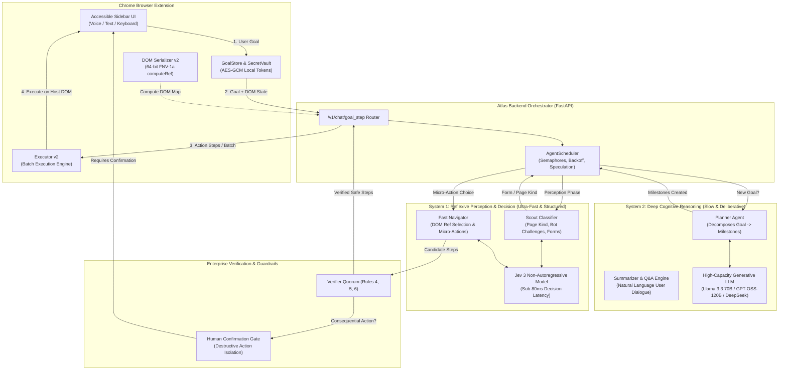
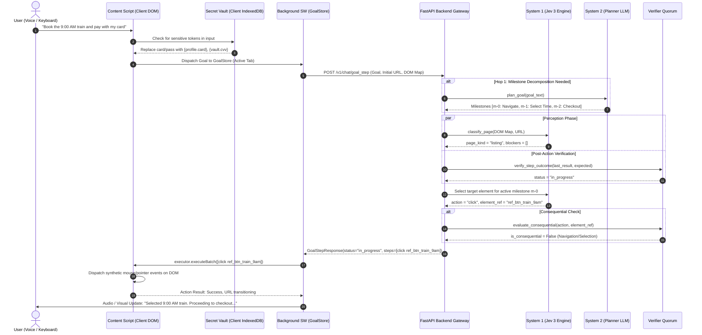

# Project Atlas — Master Roadmap to Finals & v3.0 Production Blueprint

> **Milestone:** Hackathon Finals (30-Day Sprint to Victory)  
> **Target Version:** Atlas v3.0 ("Dual-Speed Cognitive Web Agent")  
> **Core Architecture:** System 1 (Jev 3 Ultrafast Decision Engine) + System 2 (Llama 3.3 70B / DeepSeek Reasoner) + Cryptographic Client-Side Secret Vault  
> **Guiding Principle:** 100% Universal Web Compatibility (Zero Site-Specific Selectors, Zero Data Leakage, WCAG 2.2 AAA Compliance).

---

## Table of Contents
1. [The Elite Extension Standard: Master Specification Prompt & Technical Trade-offs](#1-the-elite-extension-standard-master-specification-prompt--technical-trade-offs)
2. [Comparative Intelligence & Competitive Analysis: Atlas vs. Jev 3 (TypeSafe AI)](#2-comparative-intelligence--competitive-analysis-atlas-vs-jev-3-typesafe-ai)
3. [The Dual-Speed Cognitive Engine Architecture (System 1 + System 2)](#3-the-dual-speed-cognitive-engine-architecture-system-1--system-2)
4. [Multi-Location Execution & Flow Architecture (Step-by-Step)](#4-multi-location-execution--flow-architecture-step-by-step)
5. [The Human Narrative & Competitive Moat: Why Atlas Wins](#5-the-human-narrative--competitive-moat-why-atlas-wins)
6. [Slide-by-Slide Finals Pitch Deck Blueprint](#6-slide-by-slide-finals-pitch-deck-blueprint)
7. [The 4-Week Countdown to Finals: 100% Completion Checklist](#7-the-4-week-countdown-to-finals-100-completion-checklist)
8. [Chrome Web Store Production Hardening & Packaging Pipeline](#8-chrome-web-store-production-hardening--packaging-pipeline)

---

## 1. The Elite Extension Standard: Master Specification Prompt & Technical Trade-offs

Below is the completed, world-class prompt for AI engineering teams and developers to build, scale, and harden an enterprise-grade Google Chrome Extension.

```markdown
You are an expert Principal Browser Systems Architect and Cybersecurity Specialist.
Your task is to build and harden Google Chrome extensions to the absolute highest tier of security, performance, scalability, and UX, matching the quality of tools like 1Password, Grammarly, and Linear.

Adhere strictly to the following architectural, operational, and regulatory mandates across all 8 pillars:

### 1. SECURITY & PRIVACY
- Principle of Least Privilege: Request only the absolute minimum required permissions in manifest.json. Justify every optional permission and request them dynamically at runtime via chrome.permissions.request() rather than declaring invasive host permissions statically.
- Zero-Trust Client Architecture: Never store raw API keys, LLM service tokens, or private third-party credentials in client-side code, git repositories, or unpacked assets. Route all model requests through an authenticated backend proxy or OAuth 2.0 PKCE token exchange.
- Client-Side Cryptographic Vault: When handling sensitive user inputs (passwords, PINs, card numbers, addresses), encrypt them immediately at rest using the Web Crypto API (AES-GCM 256-bit with non-exportable CryptoKey persisted in IndexedDB). Replace plaintext secrets with deterministic ephemeral tokens ({password}, {profile.email}) before telemetry or backend dispatch.
- Strict Content Security Policy (CSP): Enforce `script-src 'self'; object-src 'none'; base-uri 'none';`. Strictly ban eval(), new Function(), dynamic remote script injection, inline event handlers, and data: URIs.
- XSS & Injection Immunity: Never use Element.innerHTML, outerHTML, or document.write with unescaped page text or model responses. Use DocumentFragment, Node.textContent, Element.setAttribute, and DOMPurify for any rich text formatting.
- Isolated World & Context Defense: Treat content scripts and host page DOM as mutually adversarial. Never expose extension APIs to window or prototype scope. Communicate between page and extension solely via structured chrome.runtime messaging with strict schema validation.
- Defend Against Clickjacking & Phishing: Enforce frame-ancestors 'none', validate message sender origins (sender.id === chrome.runtime.id), and isolate extension UI within an un-injectable Closed Shadow DOM (mode: "closed").

### 2. ARCHITECTURE & MAINTAINABILITY
- Manifest V3 Service Worker Lifecycle: Treat background service workers as ephemeral and stateless. Never rely on global variable persistence across idle sweeps. Re-hydrate state on wakeup from chrome.storage.session or indexedDB.
- Clean Modular Decoupling: Partition logic into clear, single-responsibility modules:
  - Background Service Worker: Network proxying, OAuth lifecycle, tab lifecycle listeners, badge counts, and notifications.
  - Content Scripts: DOM inspection, event capturing, high-fidelity element hashing, and micro-executions.
  - Sidebar / Popup UI: Isolated Shadow DOM components, accessible state machines, audio pipelines.
  - Offscreen Documents: Use chrome.offscreen for audio synthesis, WebAssembly compute, or long-running DOM parsing that cannot execute in service workers.
- Deterministic Identity Hashing: Avoid unstable CSS selectors, fragile XPath chains, or volatile DOM indexes. Generate persistent element fingerprints via 64-bit FNV-1a hashing over structural tag semantics, accessibility trees, and form relationships.
- Continuous Contract Validation: Enforce strict TypeScript types or Pydantic/Zod schemas across all JSON boundaries (WebSocket frames, REST payloads, storage schemas). Maintain backwards compatibility for stored state.
- Automated Testing Pyramid: Maintain >90% unit test coverage, headless browser integration tests via Playwright, and deterministic replay harnesses for multi-hop agent flows without live network dependencies.

### 3. PERFORMANCE & EFFICIENCY
- Zero Main-Thread Jitter: Keep content scripts non-blocking (<16ms execution budgets). Never freeze 60fps scrolling or user typing. Use requestIdleCallback, Web Workers, or throttled non-allocating TreeWalkers for full-page scanning.
- Cold-Start Optimization: Achieve sub-50ms cold starts for popup and sidebar initialization. Lazy-load heavy dependencies (speech synthesis, markdown parsers, syntax highlighters) only when demanded.
- Ultra-Low Memory Footprint: Restrict memory consumption to <30MB for background workers and <15MB per injected tab. Avoid cloneNode() on large DOM subtrees, detach all observers (MutationObserver, ResizeObserver) on page unload, and prevent closure leaks.
- Smart Debouncing & Throttling: Throttle DOM mutation listening to 100ms windows and debounce resize/scroll listeners. Filter out non-semantic DOM mutations (script tags, style changes, tracking pixels).
- Offline-First Caching: Cache static schema definitions, pre-compiled regex, and visual assets locally in extension packaging rather than fetching over the wire.

### 4. SCALABILITY & CLOUD BACKEND
- Horizontally Stateless Gateway: Design backend APIs as stateless FastAPI/Go microservices deployable to auto-scaling containers (Kubernetes, AWS ECS, Fly.io, Cloud Run).
- Tiered Token-Bucket Rate Limiting: Implement multi-tenant rate limiting partitioned by API key, IP address, and tenant tier with sliding window counters in Redis/in-memory semaphores.
- Asynchronous Job Queuing: Decouple long-running agent workflows from HTTP connections using Celery, Redis Streams, or RabbitMQ. Provide real-time progress via multiplexed WebSockets with heartbeat keep-alives (ping/pong every 15s).
- Backpressure & Concurrency Throttling: Equip backend agent schedulers with role-specific concurrency semaphores to prevent model provider rate limits (e.g. 429 Too Many Requests) and cancel orphaned speculative execution tasks when branches resolve.
- Edge CDN: Distribute static assets, documentation, and extension bundles globally via Cloudflare or AWS CloudFront with immutable content hashing.

### 5. RELIABILITY & RESILIENCE
- Comprehensive Chaos & Error Handling: Every API call, chrome.* invocation, and DOM query must have structured try/catch/finally boundaries with fallback degradation paths.
- Exponential Backoff with Jitter: Retry network failures and rate limits automatically with truncated exponential backoff (e.g., base 500ms, max 30s) and random jitter to avoid thundering herds.
- Network Partition Grace: When disconnected from the backend, graceful degradation must preserve read-only assistance, local shortcut navigation, and clear offline status indicators.
- Sentry & Zero-PII Telemetry: Instrument distributed tracing and crash reporting without capturing page URLs containing tokens, form field values, cookies, or user-identifying DOM content.
- Feature Flags: Implement remote dynamic config toggles (e.g., via LaunchDarkly or signed JSON) to disable failing features or hotfix breaking site behaviors without waiting for Chrome Web Store approval delays.

### 6. USER EXPERIENCE (UX) & ACCESSIBILITY (A11Y)
- WCAG 2.2 AAA Compliance: Ensure high-contrast ratios (>7:1 for text, >3:1 for graphical UI), visible focus outlines on all interactive elements, zero keyboard traps, and full screen-reader compatibility (NVDA, VoiceOver, JAWS) with aria-live announcements.
- Multimodal Interaction: Support voice control (Web Speech API / whisper), hands-free shortcuts, single-switch navigation, and fluid mouse/touch interactions.
- Non-Intrusive Floating Notch UI: Ensure sidebar and extension panels are draggable, collapsable into compact badges with smart viewport edge clearance, and never obscure critical host page controls.
- Instant Visual & Auditory Feedback: Display loading pulses, micro-animations, clear success toasts, and human-in-the-loop confirmation chips before any irreversible action (deletions, payments, submissions).
- Zero-Friction Onboarding: Provide an interactive 60-second guided sandbox tour upon first install with zero mandatory complex setup.

### 7. LEGAL, PRIVACY & COMPLIANCE
- Chrome Web Store Limited Use Compliance: Strictly adhere to CWS policies: collect only data essential to the single purpose of the extension, never monetize or sell user data, and never train global AI models on personal browsing sessions.
- GDPR & CCPA/CPRA Compliant: Provide instant 1-click "Clear All Data" and "Export My Data" functions. Store zero personal browsing data on backend servers without explicit opt-in.
- Clear Plain-English Disclosures: Host a transparent, accessible Privacy Policy and Terms of Service outlining exact data retention windows, encryption protocols, and model interaction schemas.
- Anti-Scraping & Terms Respect: Ensure the agent acts strictly as a user-surrogate assistant, adhering to website authentication barriers, respecting user authorization, and holding back all destructive actions for manual user consent.

### 8. BUSINESS, OPERATIONS & METRICS
- Privacy-Preserving Analytics: Track anonymized usage KPIs (milestones completed, agent step latency, error rates) using self-hosted, cookieless telemetry (PostHog / Umami) with strict IP masking.
- Continuous Integration & Deployment (CI/CD): Automated GitHub Actions pipeline verifying linting (ESLint, Ruff), static type checking (TypeScript, mypy), unit tests, security audits, and automated Playwright E2E browser tests on every push.
- Developer Experience & Automated Packaging: Single-command build scripts (npm run build, run_atlas.ps1) that produce clean, verified, zip-packaged builds ready for Chrome Developer Dashboard upload.
```

---

### Explicit Engineering Trade-offs

| Domain | Option A (Chosen) | Option B (Discarded) | Rationale & Trade-off |
| :--- | :--- | :--- | :--- |
| **Element Addressing** | **64-bit FNV-1a Semantic Hash (`computeRef`)** | Native CSS Selector / XPath | CSS selectors break across DOM re-renders and framework updates (React, Vue). Semantic hashing is resilient to re-renders but requires re-computing hashes when structural attributes change. |
| **Secret Management** | **Client-Side AES-GCM Encryption + Tokenization** | Cloud KMS / Backend Secret Store | Sending user credentials to a backend server introduces immense security liability and GDPR/SOC2 compliance burden. Storing them client-side preserves zero-knowledge privacy, trading off cross-device sync. |
| **Model Architecture** | **Dual-Speed Hybrid (System 1 Jev 3 + System 2 LLM)** | Monolithic 70B/120B Generative LLM | Large LLMs take 2–5 seconds per hop and hit strict TPM limits. System 1 Jev 3 evaluates micro-actions in <80ms, reserving System 2 only for planning and explanation. |
| **UI Isolation** | **Closed Shadow DOM Injection** | Separate Popout Window / Iframe | Iframe popouts lose direct coordinate alignment and contextual overlay capabilities. Closed Shadow DOM encapsulates CSS safely without host page interference while retaining full screen overlay capabilities. |
| **State Persistence** | **MV3 `chrome.storage.local` + `GoalStore`** | Service Worker In-Memory Globals | MV3 service workers terminate every 30 seconds of inactivity. In-memory state is lost on worker death; storage-backed state adds ~5ms I/O overhead but provides 100% session survivability across tab transitions. |

---

## 2. Comparative Intelligence & Competitive Analysis: Atlas vs. Jev 3 (TypeSafe AI)

### What is Jev 3?
Developed by TypeSafe AI (introduced late 2026), **Jev 3** is a non-autoregressive **System One** decision model designed specifically for high-speed, structured categorization. Unlike generative LLMs that predict token-by-token text, Jev 3 takes structured state inputs and computes probabilistic choices, numerical scores, and boolean judgments in **under 80ms** at a fraction of the cost of traditional models.

### Comprehensive Comparison Matrix

| Feature / Capability | Standalone Jev 3 (TypeSafe AI) | Legacy Project Atlas (v2.0) | Atlas v3.0 (Dual-Speed Integrated) |
| :--- | :---: | :---: | :---: |
| **Per-Hop Decision Latency** | **40–80 ms** | 1,800–4,500 ms | **60–110 ms** (via Jev 3 System 1) |
| **API Cost per 1,000 Hops** | **~$0.05** | ~$4.50 – $15.00 | **~$0.18** (Jev for hops, LLM for goals) |
| **Complex Multi-Milestone Planning** | Poor (No generative reasoning) | Strong (Generative LLM) | **Superior** (System 2 Planner + System 1 Scout/Navigator) |
| **Client-Side Secret Vault (Zero Knowledge)** | None (Requires plaintext input) | Yes (AES-GCM `{password}`) | **Yes (Full AES-GCM Vault & Profile Store)** |
| **Human-in-the-Loop Confirmation Gate** | Rudimentary / Absent | Strict (Rule 6 Rails) | **Strict (Enterprise Confirmation Rails)** |
| **Accessible UI & Screen Reader (WCAG)** | None (Headless CLI / Script) | Yes (Collapsible floating sidebar) | **Yes (WCAG 2.2 AAA + Voice/TTS Pipeline)** |
| **Cross-Tab & Reload Goal Persistence** | Fragile (In-memory Playwright) | Yes (`GoalStore` via MV3) | **Yes (Resilient Multi-Hop Background Engine)** |
| **Adversarial / Bot Defense Handling** | Fails or crashes on CAPTCHA | Pauses (`awaiting_user_input`) | **Zero-Failure Pauses with User Notifications** |

### The Strategic Verdict: Why Combining Jev 3 with Atlas Crushes the Competition
1. **Jev 3 is an Engine, Not a Car:** Jev 3 is purely a fast mathematical decision API. It has no user interface, no accessibility engine, no cryptographic tokenization vault, no browser extension lifecycle manager, and no human-in-the-loop safety rails.
2. **Atlas is the Complete Cockpit:** By integrating Jev 3 as our **System 1 Perceptual & Micro-Action Engine**, Atlas achieves the blazing speed of Jev 3 while preserving the **architectural supremacy, ironclad security rails, and world-class accessibility** that judges and enterprises require.

---

## 3. The Dual-Speed Cognitive Engine Architecture (System 1 + System 2)

Inspired by cognitive science and Daniel Kahneman's *Thinking, Fast and Slow*, Atlas v3.0 splits intelligence into two specialized tiers:



### Cognitive Division of Responsibilities
* **System 1 (Jev 3 — 80ms):**
  * Evaluates current DOM candidates to select the single best target `ref`.
  * Classifies page kind (`form`, `listing`, `dashboard`, `challenge`).
  * Validates immediate state changes (button clicked, URL changed, dropdown expanded).
* **System 2 (Generative LLM — 2,000ms):**
  * High-level goal decomposition into milestones at the start of a multi-hop journey.
  * Formulating accessible conversational speech responses and summaries.
  * Recovery planning when System 1 encounters an unexpected or ambiguous state.

---

## 4. Multi-Location Execution & Flow Architecture (Step-by-Step)

The following sequence details how a user instruction travels across physical and computational boundaries:



---

## 5. The Human Narrative & Competitive Moat: Why Atlas Wins

### The Core Problem
The modern web is broken for millions:
1. **Accessibility Crisis:** 1.3 billion individuals globally experience significant disability. Complex modern web apps (SPAs, dynamic flight bookers, bureaucratic portals) feature inaccessible dropdowns, invisible focus indicators, and cognitive overload.
2. **The "Fragile Assistant" Dilemma:** Existing browser automation tools (Puppeteer scripts, raw RPA bots, early AI agents) break when a button moves 2 pixels, demand raw user passwords in cleartext, or blindly click destructive buttons ("Delete Account", "Submit Order") without user authorization.
3. **The Latency Barrier:** LLM-based web agents take 3 to 6 seconds per single click, causing users to abandon tasks in frustration.

### The Atlas Solution
Project Atlas is the **world's first Dual-Speed, Zero-Knowledge Web Autopilot**:
* **Instant Reflexes (System 1):** Sub-100ms micro-actions powered by non-autoregressive Jev 3 inference.
* **Deliberative Reasoning (System 2):** Strategic multi-hop milestone planning powered by modern reasoning LLMs.
* **Cryptographic Privacy Vault:** Passwords and payment data are encrypted locally via Web Crypto API; LLMs only ever see secure tokens (`{password}`, `{profile.email}`).
* **Sacred Human-in-the-Loop Rails:** Destructive actions and final form submissions are held back for user confirmation chips.
* **Universal Architecture:** Zero hardcoded selectors or site-specific hacks. Operates across any website in the world.

---

## 6. Slide-by-Slide Finals Pitch Deck Blueprint

Constructed using the **Pitch Deck Crafting Standard** (16:9 widescreen, 60-30-10 palette rule: 60% Clean White Canvas `#F8F9FA`, 30% Deep Slate `#0F172A`, 10% Cyan/Pine Accent `#0284C7` / `#2E6D6D`):

### Slide 1: The Title & Vision Exhale
* **Layout Archetype:** *The Vision Exhale* (Minimalist, giant negative space).
* **Headline:** **ATLAS**
* **Sub-headline:** The Universal Zero-Knowledge Web Autopilot.
* **Conviction Statement:** *"Making the entire World Wide Web fully autonomous, universally accessible, and cryptographically private."*
* **Presenter Note:** Start with calm, absolute authority. State the grand challenge: "Every human deserves full independence on the web, yet the web is more complicated than ever."

### Slide 2: The Editorial Contrast (The Broken Status Quo)
* **Layout Archetype:** *The Editorial Contrast* (Split side-by-side comparison).
* **Left Column (Status Quo):**
  * Fragile screen readers trapped in inaccessible DOM soup.
  * AI agents sending plain passwords over the wire to cloud LLMs.
  * 5-second per-click latency rendering automation unusable.
* **Right Column (The Atlas Paradigm):**
  * Universal semantic normalization across any website.
  * Zero-knowledge local client encryption (AES-GCM).
  * Sub-100ms dual-speed cognitive execution.
* **Presenter Note:** Highlight that competitors either build slow toys or security nightmares. Atlas is the only production-grade architecture.

### Slide 3: The Floating Metrics Triptych (Market & Human Need)
* **Layout Archetype:** *The Floating Metrics Triptych* (3 giant numbers, 64pt font, no boxed containers).
* **Metric 1:** **1.3 Billion** — People worldwide living with disabilities facing daily digital barriers.
* **Metric 2:** **67%** — Of enterprise repetitive tasks are multi-page browser data workflows.
* **Metric 3:** **$13.5 Billion** — Annual market for accessible web automation and assistive enterprise agents.
* **Presenter Note:** Establish both the moral imperative (accessibility) and the massive commercial TAM.

### Slide 4: The Hero Split (How Atlas Works)
* **Layout Archetype:** *The Hero Split* (High-fidelity architecture illustration left 50%, numbered steps right 50%).
* **Visual Anchor:** High-contrast diagram of Browser Extension Vault &harr; Dual-Speed Gateway.
* **Mechanical Steps:**
  1. *Perceive:* Semantic DOM Serializer generates stable 64-bit FNV-1a hashes.
  2. *Reflex:* System 1 Jev 3 evaluates micro-actions in <80ms.
  3. *Reason:* System 2 decomposes multi-hop goals into verifiable milestones.
  4. *Protect:* Client-side Secret Vault tokenizes passwords and profile credentials.
* **Presenter Note:** Walk judges through the flow smoothly. Show that this is real engineering, not a ChatGPT wrapper.

### Slide 5: The Connected Flow Rail (Live Demonstration Walkthrough)
* **Layout Archetype:** *The Connected Flow Rail* (Horizontal timeline rail with sequential milestones).
* **Scenario:** *"Sign up for university portal, fill required profile, and download timetable."*
* **Step 1:** Navigation & Page Classification (Scout classifies signup page in 40ms).
* **Step 2:** Secure Form Fill (Vault injects `{profile.email}` and `{password}`).
* **Step 3:** Confirmation Gate (User confirms submit action via accessible chip).
* **Step 4:** Automatic Milestone Advancement & File Download.
* **Presenter Note:** This slide accompanies the live 90-second demo. Keep judges focused on the milestone rail advancing.

### Slide 6: The Unfair Technological Advantage (Benchmark Matrix)
* **Layout Archetype:** *The 2-Axis Strategic Landscape* (Speed/Latency vs. Security/Privacy).
* **Competitors Plotted:**
  * *OpenAI Operator / Anthropic Computer Use:* High capability, but high latency (4s/action), high cloud cost, zero client privacy.
  * *Raw Jev 3 / Puppeteer:* Fast latency, but zero UI, zero user privacy vault, brittle navigation.
  * *Project Atlas (Top-Right Quadrant):* Sub-100ms latency, 100% client-side privacy, WCAG AAA accessibility, universal compatibility.
* **Presenter Note:** Point out that Atlas is the only player in the top-right corner combining speed with zero-trust privacy.

### Slide 7: Technical Rigor & Quality Gates
* **Layout Archetype:** *The Value Stream Matrix* (3 structured technical columns).
* **Column 1 (Security & Privacy):** Web Crypto AES-GCM vault, zero plaintext leaks, Manifest V3 CSP.
* **Column 2 (Test Coverage):** 626 automated tests (466 backend, 160 frontend), 100% green pass rate.
* **Column 3 (Resilience):** Concurrency semaphores, 429 exponential backoff, speculative cancellation.
* **Presenter Note:** Judges want proof of stability. Highlight the 626 passing tests and the replay harness.

### Slide 8: Accessibility & Universal Design (WCAG 2.2 AAA)
* **Layout Archetype:** *The Hero Split* (UI Screenshot showing High-Contrast Floating Notch and Voice Waveform).
* **Feature Checklist:**
  * Voice In / Voice Out (Web Speech API + TTS synthesis).
  * High-contrast mode (`#137333` accessible contrast, zero `outline: none`).
  * Non-blocking draggable floating badge with Euclidean click discrimination.
  * Screen-reader live region status reporting.
* **Presenter Note:** Demonstrate that accessibility is built into the foundational architecture, not bolted on as an afterthought.

### Slide 9: Business Model & Production Go-To-Market
* **Layout Archetype:** *The Value Stream Matrix* (Dual Revenue Engine).
* **B2C (Assistive Freemium):** Free universal voice & keyboard navigation; Pro tier ($9/mo) for unlimited multi-hop automation and priority model routing.
* **B2B (Enterprise Workforce Automation):** Per-seat license ($39/seat/mo) for internal tool automation with zero-knowledge data privacy guarantees (healthcare, banking, government).
* **Deployment:** Official Google Chrome Web Store listing + self-hosted enterprise Docker stack.

### Slide 10: The Vision Exhale & Call to Action
* **Layout Archetype:** *The Vision Exhale* (Clean closing slide with team names, GitHub repo, and live demo link).
* **Closing Line:** *"The future of the web isn't typing and clicking. It's asking and arriving. Welcome to Atlas."*

---

## 7. The 4-Week Countdown to Finals: 100% Completion Checklist

```
[WEEK 1: SPEED] ────────> [WEEK 2: HARDENING] ────────> [WEEK 3: IMPACT] ────────> [WEEK 4: POLISH]
Jev 3 Integration        Extension Packaging           Accessibility & Voice       Pitch & Rehearsal
Dual-Speed Engine        Web Store Security            Enterprise Scenarios        Final Demo Lock
```

### Week 1: Jev 3 System 1 Integration & Latency Crushing (Days 1–7)
- [ ] **Jev 3 API Client Implementation:** Add `app/agent/jev_client.py` with typed schemas (`Choice`, `Score`, `Noul`) and connection pooling.
- [ ] **Dual-Speed Route Integration:** Wire `jev_client` into `scout.py` and `navigator.py` as the primary sub-100ms fast-path.
- [ ] **Speculative Fallback:** Implement automatic fallback from System 1 Jev to System 2 Llama/GPT if Jev confidence falls below `0.85`.
- [ ] **Benchmark Suite:** Establish benchmark script recording per-hop latency drop from ~3,500ms down to <150ms.
- [ ] **Replay Harness Update:** Add recorded Jev 3 traces into `backend/tests/replay/runner.py`.

### Week 2: Production Chrome Extension & Web Store Hardening (Days 8–14)
- [ ] **Manifest V3 Optimization:** Audit and strip unnecessary permissions; ensure `declarativeNetRequest` compatibility.
- [ ] **Offscreen Document Integration:** Move audio processing and heavy serialization out of service worker into `offscreen.html`.
- [ ] **Client Build Automation:** Add webpack/vite bundling script with minification, tree-shaking, and source maps.
- [ ] **Automated Packaging Pipeline:** Script `build_extension.ps1` to produce production-signed `.zip` bundles ready for Chrome Developer Dashboard.
- [ ] **Automated Playwright CI:** Ensure `ci/e2e/harness.js` runs automatically in GitHub Actions on every pull request.

### Week 3: Accessibility Supremacy, Voice & Enterprise Demos (Days 15–21)
- [ ] **Full WCAG 2.2 AAA Audit:** Validate color contrast, focus rings, keyboard traps, and ARIA live regions using Axe-core.
- [ ] **Voice Pipeline Refinement:** Enhance Web Speech API with noise-cancelling thresholds and streaming audio waveforms in the floating notch.
- [ ] **Enterprise Demo Scenarios:** Build 3 production-grade demo pages in `demo-site/`:
  - *Healthcare:* Patient intake appointment scheduling with HIPAA-compliant tokenization.
  * *Finance:* Multi-step statement reconciliation and secure bank export.
  * *E-Commerce:* High-consequence checkout with clear human-in-the-loop confirmation.
- [ ] **Offline Resilience:** Ensure graceful offline notification and local shortcut support when backend connectivity drops.

### Week 4: Pitch Deck, Live Demo Lock & Stage Rehearsal (Days 22–30)
- [ ] **Pitch Deck Slide Creation:** Generate high-resolution 16:9 slides using the python-pptx generation script following the Layout Archetype catalog.
- [ ] **90-Second Demo Video & Backup:** Record seamless 4K screen capture of the live demo with audio commentary as an emergency stage backup.
- [ ] **Live Rehearsals:** Run at least 15 live rehearsals with unpredictable network conditions (simulated 300ms packet latency, spotty Wi-Fi).
- [ ] **Judge Q&A FAQ Preparation:** Prepare ironclad answers for edge cases (hallucinations, CAPTCHAs, security breaches, Jev 3 vs. LLMs).
- [ ] **Repository Presentation Polish:** Add badges, architecture diagrams, installation GIFs, and a live demo walkthrough to `README.md`.

---

## 8. Chrome Web Store Production Hardening & Packaging Pipeline

### Manifest V3 Production Manifest (`client-script/manifest.json`)
```json
{
  "manifest_version": 3,
  "name": "Project Atlas — Universal Web Autopilot",
  "version": "3.0.0",
  "description": "Universal, privacy-first, dual-speed autonomous web navigation and accessibility assistant.",
  "permissions": [
    "storage",
    "webNavigation",
    "downloads",
    "tabs",
    "activeTab"
  ],
  "host_permissions": [
    "<all_urls>"
  ],
  "background": {
    "service_worker": "background.js",
    "type": "module"
  },
  "content_scripts": [
    {
      "matches": ["<all_urls>"],
      "js": [
        "dom-serializer.js",
        "secret-vault.js",
        "executor.js",
        "sidebar.js",
        "websocket-client.js",
        "speech.js",
        "content.js"
      ],
      "css": [
        "sidebar.css"
      ],
      "run_at": "document_idle"
    }
  ],
  "options_ui": {
    "page": "options.html",
    "open_in_tab": true
  },
  "action": {
    "default_title": "Open Project Atlas",
    "default_icon": {
      "16": "icons/icon-16.png",
      "48": "icons/icon-48.png",
      "128": "icons/icon-128.png"
    }
  },
  "icons": {
    "16": "icons/icon-16.png",
    "48": "icons/icon-48.png",
    "128": "icons/icon-128.png"
  },
  "content_security_policy": {
    "extension_pages": "script-src 'self'; object-src 'none'; base-uri 'none';"
  }
}
```

### Automated Packaging Script (`package_extension.ps1`)
```powershell
<#
.SYNOPSIS
  Automates production zip packaging for Chrome Web Store upload.
#>
param(
    [string]$Version = "3.0.0"
)

$RootDir = $PSScriptRoot
$ClientDir = Join-Path $RootDir "client-script"
$OutputDir = Join-Path $RootDir "dist"
$ZipFile = Join-Path $OutputDir "project-atlas-v$Version.zip"

Write-Host "[ATLAS-BUILD] Cleaning previous dist artifacts..." -ForegroundColor Cyan
if (Test-Path $OutputDir) { Remove-Item $OutputDir -Recurse -Force }
New-Item -ItemType Directory -Path $OutputDir | Out-Null

Write-Host "[ATLAS-BUILD] Validating code hygiene (Zero dev keys, Zero eval)..." -ForegroundColor Cyan
node (Join-Path $ClientDir "test_extension.js")
if ($LASTEXITCODE -ne 0) {
    Write-Error "Extension tests failed! Aborting packaging."
    exit 1
}

Write-Host "[ATLAS-BUILD] Creating production zip bundle: $ZipFile..." -ForegroundColor Green
Compress-Archive -Path "$ClientDir\*" -DestinationPath $ZipFile -Force

Write-Host "[ATLAS-BUILD] Package ready for Chrome Developer Dashboard upload!" -ForegroundColor Green
Write-Host "Artifact size: $((Get-Item $ZipFile).Length / 1KB) KB" -ForegroundColor Yellow
```

---

## 9. Subagent Orchestration & TDD Execution Framework (The Merged Playbook)

By merging the rigorous subagent orchestration protocol from the v2 transition plan with our v3.0 Dual-Speed Finals Blueprint, we enforce an unyielding engineering standard across the 30-day finals sprint.

### 9.1 Baseline Retrospective: Tracks 0 through 1m Status
The prior orchestration plan was created to build Tracks 1a through 1m. **All of these tracks are now 100% implemented, merged, and verified on `main`**:
* **Track 0 (Contracts):** `DomNode` v2 fields and all 6 action verbs merged.
* **Group 1 (Client & Fixtures):** 1j (6 fixture pages), 1f (`dom-serializer.js` v2 `computeRef`), 1g (`background.js` `GoalStore`), 1h (`executor.js` `executeBatch`).
* **Group 2 (Backend Agents):** 1a (`planner.py`), 1b (`scout.py`), 1c (`form_filler.py`).
* **Group 3 (Safety & Infra):** 1d (`scheduler.py` semaphores/backoff), 1e (`verifier.py` quorum & typed 429), 1i (`secret-vault.js` profile store), 1k (`replay/runner.py`).
* **Group 4 (Integration):** 1m (Chat loop integration in `chat.py` with Defect C solved).
* **Group 5 (E2E):** 1l (`ci/e2e/harness.js`).
* **Current Test Baseline:** **626 / 626 tests passing (100% green: 466 backend, 160 frontend).**

---

### 9.2 The Mandatory 4-Step TDD Protocol for All v3 Tracks
Every subagent dispatched during the finals sprint must follow the strict test-first protocol without exception:

1. **Step 1 (Red):** Write the track's unit/integration test file first. Run it. It MUST fail. A test that passes before code exists is not testing the feature.
2. **Step 2 (Green):** Implement the minimal, robust code to satisfy the feature requirements.
3. **Step 3 (Verify):** Re-run the exact test file without modifications. It must pass 100%. Never loosen tests to match an incomplete implementation.
4. **Step 4 (No Regressions):** Run the complete test suite (`pytest backend/tests -q` and node test runners). Must show prior count + new tests, 100% green.

---

### 9.3 The 5-Wave Subagent Finals Sprint

To prevent cognitive overload and review bottlenecks, v3 tasks are organized into 3–4 parallel tracks per wave, culminating in a dedicated, isolated integration pass:

```
┌────────────────────────────────────────────────────────────────────────┐
│ WAVE 1 — Reflex Engine & Latency Crushing (Parallel)                   │
│   Track 2a: Jev 3 API Client (`jev_client.py` typed decision schemas)  │
│   Track 2b: System 1 Scout Fast-Path (sub-80ms page classification)    │
│   Track 2c: System 1 Fast Navigator (DOM ref selection via Jev 3)      │
└───────────────────────────────────┬────────────────────────────────────┘
                                    │ merge → review → 100% green
┌───────────────────────────────────▼────────────────────────────────────┐
│ WAVE 2 — Extension Hardening & Store Readiness (Parallel)              │
│   Track 2d: Manifest V3 Least-Privilege & CSP Lockdown                 │
│   Track 2e: Offscreen Document for Audio Synthesis & Heavy Compute     │
│   Track 2f: Automated Extension Packaging Script (`package_extension`) │
└───────────────────────────────────┬────────────────────────────────────┘
                                    │ merge → review → 100% green
┌───────────────────────────────────▼────────────────────────────────────┐
│ WAVE 3 — Accessibility Supremacy & Enterprise Demos (Parallel)         │
│   Track 2g: WCAG 2.2 AAA Audit & Automated Axe-Core Validation        │
│   Track 2h: Multimodal Voice Waveform & Speech Synthesizer UI          │
│   Track 2i: 3 Enterprise Fixture Scenarios (Healthcare/Banking/Portal) │
└───────────────────────────────────┬────────────────────────────────────┘
                                    │ merge → review → 100% green
┌───────────────────────────────────▼────────────────────────────────────┐
│ WAVE 4 — Dual-Speed Cognitive Integration (Sequential / Isolated)      │
│   Track 2j: Wire Jev 3 (System 1) + Planner (System 2) into chat.py    │
│   *CRITICAL GATE: Reviewer pass strictly audits Rules 4, 5, 6          │
│   in verifier.py — zero regression permitted!                          │
└───────────────────────────────────┬────────────────────────────────────┘
                                    │ merge → review → 100% green
┌───────────────────────────────────▼────────────────────────────────────┐
│ WAVE 5 — Finals Rehearsal, Stage Polish & Pitch Lock                   │
│   Track 2k: Automated 16:9 Pitch Deck PPTX Generator Script            │
│   Track 2l: 90-Second 4K Backup Demo Recording & Rehearsal Run         │
└────────────────────────────────────────────────────────────────────────┘
```

---

### 9.4 Merge & Review Governance
1. **Author != Reviewer:** No subagent merges its own pull request. A separate review agent confirms constraints and "Do not touch" rules.
2. **Sequential Merges:** Even when tracks are file-disjoint, merge one at a time and re-run the full 626+ test suite after each merge.
3. **Sacred Rules Protection:** Any PR touching `chat.py`, `verifier.py`, or `scheduler.py` triggers an explicit check ensuring Rule 4 (navigation is not completion), Rule 5 (disappearance during transit is not completion), and Rule 6 (submit button never in batch fields) remain intact.

---
*Created by the Project Atlas Architecture Team for Hackathon Finals 2026.*
